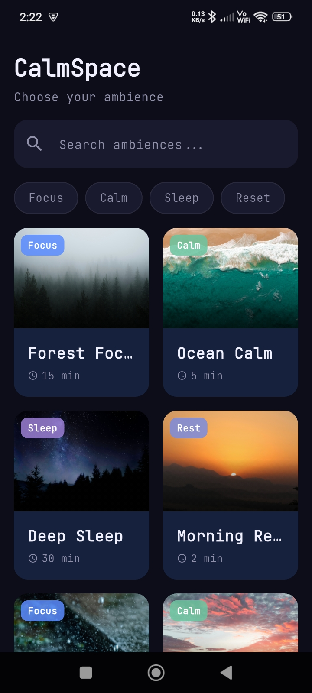
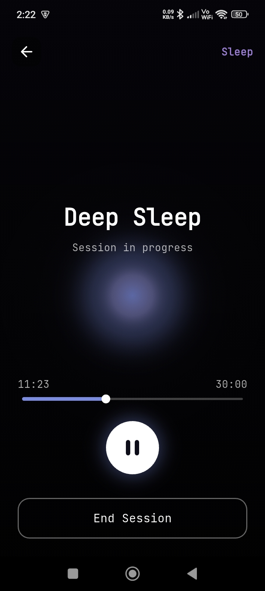
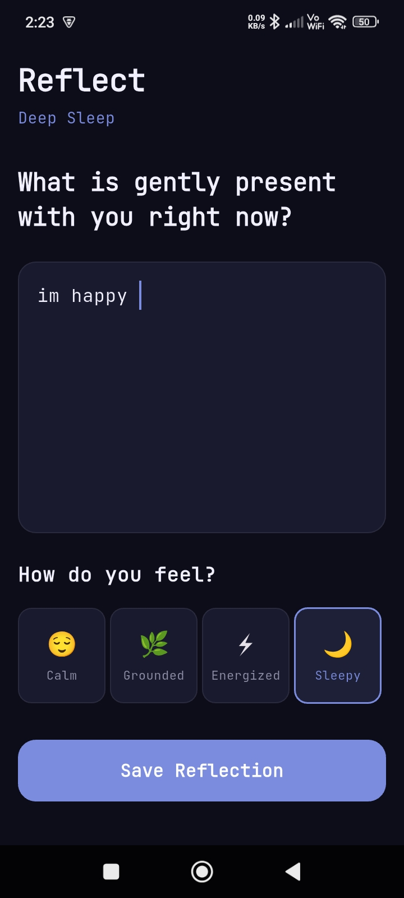

# CalmSpace 🌿

A minimal, premium ambient soundscape app built as an interview assignment for **ArvyaX Flutter Developer** role.

> _"Stillness is not the absence of sound — it's the presence of intention."_

---


## 🚀 How to Run

### Prerequisites

- Flutter SDK `>=3.4.0`
- Dart SDK `>=3.4.0`
- Android Studio / Xcode (for emulator/device)
- A connected Android device or emulator

### Steps

```bash
# 1. Clone the repository
git clone https://github.com/YOUR_USERNAME/calmspace.git
cd calmspace

# 2. Install dependencies
flutter pub get

# 3. Run on connected device or emulator
flutter run

# 4. (Optional) Run in release mode
flutter run --release
```

### Build APK

```bash
flutter build apk --release

# Output location:
# build/app/outputs/flutter-apk/app-release.apk
```

---

## 🏗️ Architecture

### Folder Structure

```
lib/
├── main.dart               
│
├───data
│   ├───models
│   │       ambience.dart
│   │       journal_entry.dart
│   │
│   └───repositories
│           ambience_repository.dart
│           database_helper.dart
│           journal_repository.dart
│
├───features
│   ├───ambience
│   │   │   ambience_provider.dart
│   │   │
│   │   ├───screens
│   │   │       ambience_detail_screen.dart
│   │   │       home_screen.dart
│   │   │
│   │   └───widgets
│   │           ambience_card.dart
│   │           search_bar.dart
│   │           tag_filter_chips.dart
│   │
│   ├───journal
│   │   │   journal_provider.dart
│   │   │
│   │   └───screens
│   │           journal_history_screen.dart
│   │           reflection_screen.dart
│   │
│   └───player
│       │   audio_service.dart
│       │   player_provider.dart
│       │
│       ├───screens
│       │       session_player_screen.dart
│       │
│       └───widgets
│               mini_player.dart
│
└───shared
    ├───theme
    │       app_theme.dart
    │
    └───widgets
```

---

### State Management — Riverpod 3.x (Notifier API)

CalmSpace uses **Riverpod 3.x** with the modern `Notifier` / `AsyncNotifier` pattern throughout.

**Why Riverpod?**
- Compile-safe providers — no string keys, no `BuildContext` dependency
- `AsyncNotifier` makes loading/error/data states explicit and boilerplate-free
- Easy to test: providers are pure Dart, no widget tree required
- `ref.watch` / `ref.invalidate` give fine-grained reactivity

**Key providers:**

| Provider | Type | Responsibility |
|---|---|---|
| `ambienceListProvider` | `AsyncNotifier` | Loads JSON, holds search query + tag filter |
| `filteredAmbiencesProvider` | `Provider` (derived) | Computed filtered list from above |
| `sessionProvider` | `Notifier` | Audio playback, timer countdown, mini-player visibility |
| `journalProvider` | `AsyncNotifier` | SQLite CRUD for journal entries |

---

### Data Flow

```
JSON / SQLite
     │
     ▼
Repository (data/repositories/)
  – Pure Dart, no Flutter dependency
  – AmbienceRepository: parses assets/data/ambiences.json
  – JournalRepository: wraps sqflite (open, insert, query, etc.)
     │
     ▼
Notifier / AsyncNotifier  (features/*/providers/)
  – Calls repository methods
  – Exposes immutable state to UI
  – Handles loading / error states internally
     │
     ▼
Screen / Widget  (features/*/screens/ + widgets/)
  – ConsumerWidget watches providers
  – Calls notifier methods on user interaction
  – Never touches repository directly
```

---

## 📦 Packages Used

| Package | Version | Why chosen |
|---|---|---|
| `flutter_riverpod` | ^3.2.1 | Modern, compile-safe state management; Notifier API removes boilerplate |
| `just_audio` | ^0.9.42 | Best-in-class audio player for Flutter; supports looping, seeking, streams |
| `sqflite` | ^2.4.2 | Lightweight SQLite wrapper; ideal for structured local persistence without heavy ORM overhead |
| `path` + `path_provider` | ^1.9 / ^2.1 | Cross-platform file path resolution required by sqflite |
| `go_router` | ^14.6.3 | Declarative, URL-based routing; supports nested routes and `ShellRoute` for persistent mini-player |
| `uuid` | ^4.5.1 | Collision-free IDs for journal entries without a backend |
| `google_fonts` | ^6.2.1 | JetBrains Mono for a calm, typographically distinct UI feel |

---

### Current Tradeoffs

- **No background audio service** — `just_audio` plays audio fine in foreground, but if the app is fully backgrounded on some Android OEMs, audio may pause. A production app would use `audio_service` for a proper background service with lock-screen controls.
- **SQLite over Hive** — SQLite was chosen for relational query flexibility (filter by mood, date range). Hive would be faster to set up and slightly better for pure key-value storage, but lacks SQL expressiveness.
- **Local JSON for ambiences** — The ambience list is static. In production this would be a remote CMS (Contentful / Supabase) with caching.
- **Placeholder images/audio** — Asset quality does not affect architecture, but real curated assets would significantly elevate the premium feel.


## 📸 Screenshots

| Home | Player | Reflection |
|------|--------|------------|
|  |  |  |

## 📱 Screen Recording

[▶️ Watch Demo Video](media/Screenrecorder-2026-03-12-02-26-28-578.mp4)
